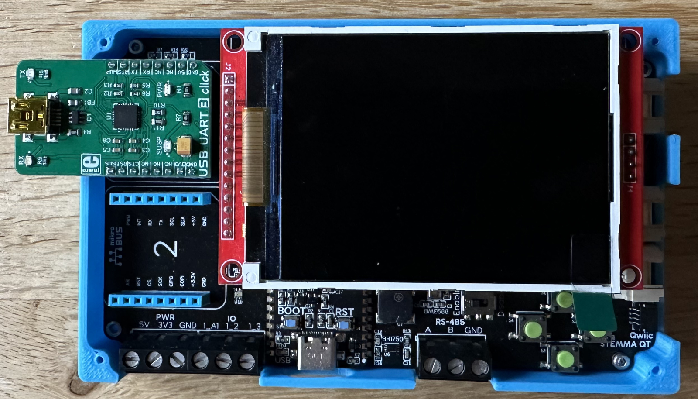

# Logging

There a several sources of log information available through one of the UART ports (COM1) on the Meadow boards:

* Operating system logging
* Application output
* ESP32 logging

All of these sources can be turned on through settings in the `meadow.config.yaml` file.

`COM1` is also available to managed code and so these logging features can only be used with applications that do not require the use of `COM1`.

## Additional Hardware

It is necessary to attach a USB<->TTL device to both the Meadow device and a host computer in order for the additional logging to work correctly.  These devices convert the signals from `COM1` on a Meadow device into serial data that can be read by a Terminal / Console application running on a host computer.

For Project Lab users there is a ready made board that will do this conversion.  The [USB UART Click 3](https://www.mikroe.com/usb-uart-3-click) drops into Mikro Bus slot 1 on the Project Lab (note that it must be slot 1).



Other adapters are available and in ese cases only two connections are required:

* GND on the adapter to GND on the Meadow board
* R<sub>x</sub> on the adapter to T<sub>x</sub> on the Meadow board

The Meadow boards use the following communication settings:

* Baud rate: 115200
* Parity: None
* Data bits: 8
* Stop bits: 1

## Default Settings

The default setting is for no log output on `COM1`.  This leaves the serial port available to the user application.  So connecting the USB<->TTL adapter to a Terminal application will initially result in no output.

## Operating System Logging

Operating system logging can be turned on using two methods:

* `meadow` CLI
* Settings in the `meadow.config.yaml` file

Using `meadow` CLI can be used to turn logging on temporarily.  The setting will be lost once the board loses power.  The setting will be retained through resets but not power cycles.  Using CLI requires the following two commands to be executed:

* `meadow trace level 2`
* `meadow uart trace enable`

Note that these commands are not required if the configuration file route is chosen.

Using `meadow.config.yaml` is more permanent as the settings in this file are read and applied when the operating system starts.  These settings will therefore be retained for as long as a config file is present with the logging settings enabled.

To turn on logging the following needs adding to the `meadow.config.yaml` file:

```yaml
InternalDebug:
    #
    #   Redirect trace output to UART1 (COM1)
    #
    Uart1Use: trace
    #
    #   Set the level of information going to the trace output.
    #   Valid values: 1-4
    #
    TraceLevel: 2
```

Now attach a serial terminal / console application to the USB<->TTL convertor board discussed above and reset the board.  The terminal application should display something similar to the following:

```
Meadow initialization has begun at 15:37:32 UTC Meadow time.

[    0.000000] [ 0] stm32_rng_initialize: Initializing RNG
[    0.079000] [ 3] meadow_upd_initialize
[    0.079000] [ 3] F/S creating 1 partition
[    0.079000] [ 3] Partitioning complete. Init partitions
[    0.079000] [ 3] F/S Part Init complete, mount & format
[    0.079000] [ 3] hcom_nx/create_fs/hcom_nx_fs.c@253-Mounted partition 0 as '/dev/little0p0' to '/meadow0' for type 'littlefs'
[    0.080000] [ 3] F/S creation complete
[    0.424000] [ 3] Erasing flash memory
[    0.490000] [ 3] Erase success
[    0.500000] [ 3] Meadow reset code: 0x14, reset count: 273, power cycle count 11
[    0.846000] [ 8] (Note) Meadow 1.12.7.38 rebooted, H/W:F7CoreComputeV2, Mono:Disabled, Trace level:0x7f, to:none (ramlog)
[    0.846000] [ 8] (Note) Mono version: 1.12.7.38
```

It is possible that other information could be displayed depending upon the operating system build.

Note that operating system logging must always be enabled in order for any of the remaining logging features to work.

## Application Output

It is also possible to copy the output from `Console` and `Resolver` classes on the same terminal.  This can be desirable when debugging low power or battery powered systems as you can isolate the power from USB and also from the USB<->TLL adapter from the system being developed.

Using `COM1` for application output also has the benefit that a host computer will keep the serial port open, even if the Meadow device reboots.  This will allow for more information to be gathered about any restarts.

Application output can be enabled by adding the following to the `meadow.config.yaml` file:

```yaml
InternalDebug:
    #
    #   Redirect trace output to UART1 (COM1)
    #
    Uart1Use: trace
    #
    #   Set the level of information going to the trace output.
    #   Valid values: 1-4
    #
    TraceLevel: 2
    #
    #   Should we copy the application output to the UART (COM1) ?
    #
    CopyApplicationOutputToUart: true
```

Enabling this output will present the something like the following:

```
[    0.000000] [ 0] stm32_rng_initialize: Initializing RNG
[    0.079000] [ 3] meadow_upd_initialize
[    0.079000] [ 3] F/S creating 1 partition
[    0.079000] [ 3] Partitioning complete. Init partitions
[    0.079000] [ 3] F/S Part Init complete, mount & format
[    0.079000] [ 3] hcom_nx/create_fs/hcom_nx_fs.c@253-Mounted partition 0 as '/dev/little0p0' to '/meadow0' for type 'littlefs'
[    0.080000] [ 3] F/S creation complete
[    0.424000] [ 3] Erasing flash memory
[    0.490000] [ 3] Erase success
[    0.500000] [ 3] Meadow reset code: 0x14, reset count: 273, power cycle count 11
[    0.719000] [ 8] (Note) Meadow 1.12.7.38 rebooted, H/W:F7CoreComputeV2, Mono:Enabled, Trace level:0x7f, to:none (ramlog)
[    0.719000] [ 8] (Note) Mono version: 1.12.7.38
[    0.762000] [ 8] (Note) mono/hcom_mono_control.c@355-Attempting to start mono
[    0.762000] [ 8] (Info) mono/hcom_mono_control.c@383-MONO launched [pid:14, pri:80, stack size:65536]
[    1.738000] [14] Mono runtime copied into RAM.
[    1.740000] [14] (Info) nx_rqsts/hcom_via_nx_access.c@99-SUCCESS /dev/nxupd opened
[    1.742000] [14] (Note) mono/hcom_mono_control.c@732-Mono started successfully
[    8.647000] [10] (Info) Initializing OS... 
[   10.831000] [10] (Info) Parsing app.config.yaml...
[   12.900000] [10] (Info) Log level: Information
[   14.509000] [10] (Info) MeadowApp
[   18.183000] [10] (Info) Device is configured to use WiFi for the network interface
[   23.259000] [10] (Info) All cloud features are disabled.
[   26.950000] [10] (Info) [+0:0:19.067] ioctl I2CData returned -1. Last error: 125
[   27.104000] [10] (Info) [+0:0:20.343] Instantiating Project Lab v3 specific hardware
[   36.343000] [10] (Info) Hardware version: 3
[   36.378000] [10] (Info) Reset reason: 0x14
[   36.386000] [10] (Info) Reset cycle count: 31
[   36.393000] [10] (Info) Power cycle count: 3
[   36.490000] [10] (Info) [+0:0:29.728] OS version: 1.12.7.15
[   36.502000] [10] (Info) [+0:0:29.74] Build date: 10 Jul 2024 14:28:13 UTC
[   36.508000] [10] (Info) [+0:0:29.747] Device name: WiFiBasics
[   36.519000] [10] (Info) [+0:0:29.757] Processor serial number: 206E3865554B
[   36.529000] [10] (Info) [+0:0:29.767] Processor ID: 2b-00-3d-00-0d-50-4b-55-30-38-31-20
[   36.538000] [10] (Info) [+0:0:29.776] Model: F7Micro
[   36.548000] [10] (Info) [+0:0:29.786] Processor type: STM32F777IIK6
[   36.554000] [10] (Info) [+0:0:29.792] Product: F7CoreComputeV2
[   36.564000] [10] (Info) [+0:0:29.802] Coprocessor type: ESP32
[   36.573000] [10] (Info) [+0:0:29.811] Coprocessor firmware version: 1.12.5.3
[   36.579000] [10] (Info) [+0:0:29.817] Selected network: WiFi
[   36.587000] [10] (Info) [+0:0:29.825] SD card storage supported: False
[   36.589000] [10] (Info) [+0:0:29.827] Reserved pins: C6;C7
[   36.764000] [10] (Info) Configured for WiFi.
[   37.454000] [10] (Info) 14:30:33: Connecting to Network...
```

As before, we start with the operating system output and then see more information about Mono starting.  This is followed by the application output.

## ESP Logging

ESP logging can be enabled through the `CoProcessor` section of the `meadow.config.yaml` file.  This requires two entries:

* LogDestination - currently only UART is supported
* LogComponents - name of the system to be logged

A special build of the ESP32 code is also needed in order to permit the use of ESP32 logging.

The following is a sample of the entries in the `meadow.config.yaml` file:

```yaml
CoProcessor:
    #
    #   Log destination.
    #
    LogDestination: UART
    #
    #   Which components should we log?
    #
    LogComponents: WiFi;System
```

`LogDestination` is always needed in order for any ESP32 log output to be shown.  `LogComponents` is not necessary and if this entry is not present then the system will only show basic information about the ESP32 firmware when the system starts.

The above will show something like the following when the system starts:

```
Meadow initialization has begun at 15:37:32 UTC Meadow time.

[    0.000000] [ 0] stm32_rng_initialize: Initializing RNG
[    0.079000] [ 3] meadow_upd_initialize
[    0.079000] [ 3] F/S creating 1 partition
[    0.079000] [ 3] Partitioning complete. Init partitions
[    0.079000] [ 3] F/S Part Init complete, mount & format
[    0.079000] [ 3] hcom_nx/create_fs/hcom_nx_fs.c@253-Mounted partition 0 as '/dev/little0p0' to '/meadow0' for type 'littlefs'
[    0.080000] [ 3] F/S creation complete
[    0.424000] [ 3] Erasing flash memory
[    0.490000] [ 3] Erase success
[    0.500000] [ 3] Meadow reset code: 0x14, reset count: 273, power cycle count 11
[    0.846000] [ 8] (Note) Meadow 1.12.7.38 rebooted, H/W:F7CoreComputeV2, Mono:Disabled, Trace level:0x7f, to:none (ramlog)
[    0.846000] [ 8] (Note) Mono version: 1.12.7.38
[    0.852000] [ 9] (Info) ESP Log: R.ets Jun  8 2016 00:22:57
[    0.852000] [ 9] (Info) ESP Log: 
[    0.857000] [ 9] (Info) ESP Log: rst:0x1 (POWERON_RESET),boot:0x13 (SPI_FAST_FLASH_BOOT)
[    0.860000] [ 9] (Info) ESP Log: configsip: 188777542, SPIWP:0xee
[    0.866000] [ 9] (Info) ESP Log: clk_drv:0x00,q_drv:0x00,d_drv:0x00,cs0_drv:0x00,hd_drv:0x00,wp_drv:0x00
[    0.868000] [ 9] (Info) ESP Log: mode:DIO, clock div:2
[    0.870000] [ 9] (Info) ESP Log: load:0x3fff0030,len:4
[    0.872000] [ 9] (Info) ESP Log: load:0x3fff0034,len:1268
[    0.875000] [ 9] (Info) ESP Log: load:0x40078000,len:11140
[    0.876000] [ 9] (Info) ESP Log: ho 0 tail 12 room 4
[    0.879000] [ 9] (Info) ESP Log: load:0x40080400,len:3864
[    0.880000] [ 9] (Info) ESP Log: entry 0x40080658
[    0.883000] [ 8] (Warn) mono/hcom_mono_control.c@422-Mono is disabled
[    1.412000] [ 9] (Info) ESP Log: I (559) cpu_start: Pro cpu up.
[    1.416000] [ 9] (Info) ESP Log: I (559) cpu_start: Application information:
[    1.420000] [ 9] (Info) ESP Log: I (559) cpu_start: Project name:     MeadowComms
[    1.424000] [ 9] (Info) ESP Log: I (559) cpu_start: App version:      1.12.5.3
[    1.429000] [ 9] (Info) ESP Log: I (563) cpu_start: Compile time:     Jul  4 2024 03:54:24
[    1.434000] [ 9] (Info) ESP Log: I (568) cpu_start: ELF file SHA256:  efd4c8e02e1a7d90...
[    1.439000] [ 9] (Info) ESP Log: I (573) cpu_start: ESP-IDF:          v4.2.5-1-g5f8de192fa
[    1.445000] [ 9] (Info) ESP Log: I (578) cpu_start: Starting app cpu, entry point is 0x40081b54
.
.
.
```

Note that the logging information from the ESP is preceded by the text `ESP Log:`.

It should also be noted that turning on ESP32 code logging can have a significant performance impact.  If `WiFi` logging is enabled then there is a significant amount of traffic between the STM32 and the ESP32 chips.  A basic loop making requests to Postman-echo over port 80 will go from 1 minute 15 seconds for 100 requests to well over 8 minutes.  ESP32 logging should really only be used when advised or requested.
