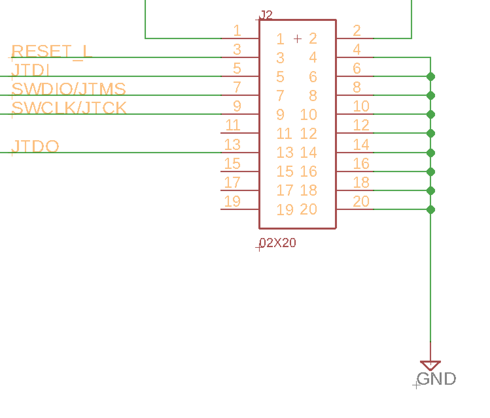
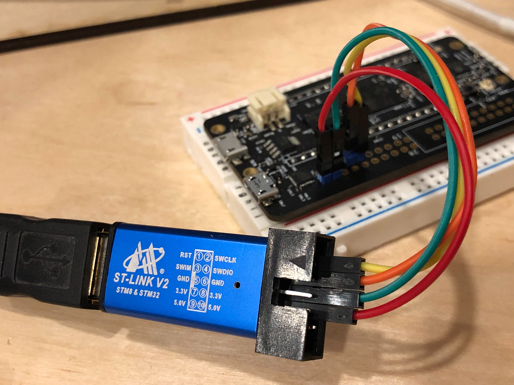

# Meadow OS

The Meadow OS stack is comprised of the following items:

 * **NuttX** - [NuttX](http://nuttx.org) is the core OS.
 * **Mono** - Currently, we have to build two different versions of Mono. One is a custom build used in NuttX, the other we build from master for `mscorlib.dll`. Additionally, mono needs the [corefx](https://github.com/WildernessLabs/corefx) submodule to build.
 * **Apps** - This contains our mono app, which is the app that runs on NuttX and launches our custom meadow applications.
 * **Various tools** - In addition to the various off-the-shelf dev tools, we use a custom build of ST-Link utilities to communicate with the board via JTAG.

Binaries of many of some of the build artfiacts can be found on [`Google Drive/Engineering/Meadow Build Artifacts`](https://drive.google.com/drive/u/0/folders/1qAgv49SRB585jm14eg7LBkMCPg_XJzNC).

## Current Branches for Building Meadow for Development

| Repo           | Branch          | Notes                     |
|----------------|-----------------|---------------------------|
| [STLink](https://github.com/WildernessLabs/stlink/tree/meadow) | Meadow   | Has our semi-hosting work. |
| [Nuttx](https://github.com/WildernessLabs/Meadow/tree/gpio) | gpio | Includes the work for GPIOs |
| [Mono](https://github.com/WildernessLabs/Mono/tree/wip-rebase) | wip-rebase | Includes GPIO work. Note, for `mscorlib.dll` generation, this needs to be built from `master`. |
| [Apps](https://github.com/WildernessLabs/Apps/tree/gpio) | gpio | Includes the GPIO work |


### Other Branches

#### Mono

 * **[wip](https://github.com/WildernessLabs/Mono/tree/wip)** - think this is old, pre-rebase and needs to be examined for changes.
 * **[nuttx_backend](https://github.com/WildernessLabs/Mono/tree/nuttx_backend)** - Alexander Kyte's work in progress for fixing mono to support NuttX out of the box. Needs to be tested and merged when Alex says it's ready.

#### Apps

 * **[wip](https://github.com/WildernessLabs/apps/tree/wip)** - needs to be merged?

## Development Environment Requirements

Mac is required to build the various pieces of Meadow. We hope to remove this requirement in the future, but it's non-trivial. If you don't have a mac, you can run [MacOS in a VM on Windows](https://techsviewer.com/install-macos-mojave-vmware-windows/).

## Development Build Instructions

### Step 1: Configure Toolchain

You'll need a number of developer tools installed. Nearly everything is done via homebrew. These tools are general developer tools and required libraries (as in the case of libusb).

1. Install Homebrew [if not installed already]. This will also prompt you to install the Xcode command line tools if they're not installed.

```bash
/usr/bin/ruby -e "$(curl -fsSL https://raw.githubusercontent.com/Homebrew/install/master/install)"
```

2. Install the following tools:

```bash
brew install osx-cross/arm/arm-gcc-bin
brew install ccache
brew install autoconf
brew install libtool
brew install cmake
brew install libusb
brew install automake
brew install dfu-install
```

If you already have one or more of the above tools installed then these can be upgraded using the following command:

```bash
brew upgrade [library]
```

### Step 1a: Build custom ST-LINK utilities

We use a custom version of the ST-Link utility that adds semi-hosting features. The ST-Link is a [JTAG](https://en.wikipedia.org/wiki/JTAG) to USB adapter. Nearly any [ST-Link V2 adapter](https://www.amazon.com/s/ref=nb_sb_noss_2?url=search-alias%3Daps&field-keywords=stlink+v2) (including cheap clones) will work for this.

Roughly speaking; semi-hosting allows us to connect the host development computer to the Meadow device as if it were part of it. Specifically, we use it right now to connect the file system and execute our Mono/Meadow applications from the `/tmp` directory. We also use it to pipe the `STDIO` (`console.writeline`) out to the host computer over JTAG

Clone the WLabs private ST-UTIL repo which has the semi-hosting magic.

 1. `cd` to your Wilderness Labs repo root
 2. Clone the [ST-Util Repo](https://github.com/WildernessLabs/stlink)
 3. Switch to the **meadow** branch

```
git clone git@github.com:WildernessLabs/stlink.git 
cd stlink
git checkout meadow
```
4. Open the **Version.cmake** file in the **cmake** folder with your favorite editor such as [Visual Studio Code](https://code.visualstudio.com/)
5. We want to delete the first if condition that checks for the version (appears to be incompatible with mac git) - delete lines 5-31. You should now have an *elseif* statement on line 5
6. Delete the **else** making it now an **if** statement
7. Save and close
8. Create **release** and **debug** builds of **ST-Link**
```
make release
make debug
```
9. Install
```
cd build/Release; sudo make install
```

### Step 2: Repository Structure

1. Create a folder called `Meadow`. Open a terminal window, change directory to where you want the `Meadow` folder and execute:

```bash
mkdir Meadow && cd Meadow
```
2. Set `MEADOW_BASE` environment variable. (This is a one time setup and can be skipped if already done. To verify, run `cat ~/.bash_profile` and ensure `export MEADOW_BASE=...` line exists.)

```bash
echo "export MEADOW_BASE=/your/local/path/to/Meadow" >> ~/.bash_profile
source ~/.bash_profile
```
To determine your local meadow path:
```bash
$ pwd
/Users/mark/SoftwareDevelopment/WildernessLabs/Meadow
```
3. Download the `GetMeadow.sh` script from this repository and put the file in the  directory created above.

4. Ensure that `GetMeadow.sh` is executable by running the following command in the terminal window:

```bash
chmod +x GetMeadow.sh
```

5. Run the `GetMeadow.sh` script:

```
./GetMeadow.sh
```

At the end of the process you should have a folder structure similar to the following:

```
 - Meadow
   |- apps
   |- nuttx
   |- mono
   |- tools
```

### Step 3. Build the Meadow OS Stack


1. Run the build meadow script in the **mono** folder
 
  ```bash
  cd ./mono/
  ./build-meadow.sh
  ```

2. Compile mono using the **make** command

  ```bash
  make
  ```
 
  This makes Mono and should build successfully

3. Update the Nuttx `.config` file to enable semi-hosting and filesystem access:

  ```bash
  cd ../nuttx

  echo "

  #
  # SEMI Hosting stuffola.
  #
  CONFIG_SEMIHOSTING=y
  CONFIG_SEMIHOSTING_OPEN=y
  CONFIG_SEMIHOSTING_WRITE=y
  CONFIG_SEMIHOSTING_READ=y
  CONFIG_SEMIHOSTING_STAT=y
  CONFIG_SEMIHOSTING_FSTAT=y
  CONFIG_SEMIHOSTING_LSEEK=y" >> .config

  sed -i "" 's/# CONFIG_FS_READABLE is not set/CONFIG_FS_READABLE=y/g' .config
  sed -i "" 's/CONFIG_USERMAIN_STACKSIZE=8192/CONFIG_USERMAIN_STACKSIZE=32768/g' .config
  sed -i "" 's/CONFIG_PTHREAD_STACK_DEFAULT=2048/CONFIG_PTHREAD_STACK_DEFAULT=32768/g' .config
  sed -i "" 's/CONFIG_EXAMPLES_MONO_STACKSIZE=2048/CONFIG_EXAMPLES_MONO_STACKSIZE=32768/g' .config
  sed -i "" 's/# CONFIG_IOEXPANDER is not set/CONFIG_IOEXPANDER=y/g' .config
  sed -i "" 's/# CONFIG_DEV_GPIO is not set/CONFIG_DEV_GPIO=y/g' .config
  ```

**TODO:** We need to figure out why the base config that sets `CONFIG_FS_READABLE=y` isn't getting propagated correctly to `.config`.

4. Make the Nuttx project:
  ```
  make clean
  make
  ```

  
### Step 5: Configure JTAG

 1. Wire the following STLink V2 pins to the JTAG connector on the board:

  | Meadow Connector | JTAG Pin Name | Meadow Pin |
|------------------|---------------|------------|
| `SWDIO`          | `TMS_SWIO`    | `7`        |
| `GND`            | `GND`         | `4`        |
| `SWCLK`          | `TMS_SWCLK`   | `9`        |
| `3.3V`           | `3.3`         | `2`        |


2 = 3.3V
4 = GND
7 = IO
9 = CLK

  The JTAG pinout is as follows, where pin one is to the left of the connector cutout, on the nearest row:

  
   
  The end result should look similar to the following:

  
  
  Note that your ST-Link adapter pinout may not match the one in the photo.

 2. Plug the ST-Link directly into your computer (or at least a powered USB hub). The ST-Link likely won't work in an unpowered hub. The ST-Link should blink red two or three times and then glow a steady red (maybe).

### Step 6: Test the ST-Link connection via the custom ST-Util

 1. From a terminal window, run:

```bash
stlink/build/Release/src/gdbserver/st-util --semihosting -v -m
```

The output should look something like the following:

```
bryans-MacBook-Pro:nuttx bryancostanich$ st-util
st-util 1.4.0
2018-03-01T19:11:27 INFO src/common.c: Loading device parameters....
2018-03-01T19:11:27 INFO src/common.c: Device connected is: F76xxx device, id 0x10006451
2018-03-01T19:11:27 INFO src/common.c: SRAM size: 0x80000 bytes (512 KiB), Flash: 0x200000 bytes (2048 KiB) in pages of 2048 bytes
2018-03-01T19:11:27 INFO src/gdbserver/gdb-server.c: Chip ID is 00000451, Core ID is  5ba02477.
2018-03-01T19:11:27 INFO src/gdbserver/gdb-server.c: Chip clidr: 09000003, I-Cache: off, D-Cache: off
2018-03-01T19:11:27 INFO src/gdbserver/gdb-server.c:  cache: LoUU: 1, LoC: 1, LoUIS: 0
2018-03-01T19:11:27 INFO src/gdbserver/gdb-server.c:  cache: ctr: 8303c003, DminLine: 32 bytes, IminLine: 32 bytes
2018-03-01T19:11:27 INFO src/gdbserver/gdb-server.c: D-Cache L0: 2018-03-01T19:11:27 INFO src/gdbserver/gdb-server.c: f00fe019 LineSize: 8, ways: 4, sets: 128 (width: 12)
2018-03-01T19:11:27 INFO src/gdbserver/gdb-server.c: I-Cache L0: 2018-03-01T19:11:27 INFO src/gdbserver/gdb-server.c: f01fe009 LineSize: 8, ways: 2, sets: 256 (width: 13)
2018-03-01T19:11:27 INFO src/gdbserver/gdb-server.c: Listening at *:4242...
```

The most important thing there is that it gets to `Listening at *:4242`. If it says `invalid chip ID` or other issue, see troubleshooting below. Likely it's not wired correctly.

Also, the ST-Link LED should change to green or blue or somesuch. 

If all is good, close ST-Util by pressing `ctrl-c`, to release ST-Util for VS Code to use.

### Step 7: Open Meadow in VS Code

There are multiple ways to build and upload the Meadow OS stack. The simplest, though not the most reliable method is to automatically build in VS Code and deploy that way. It uses the ST-Flash utility to deploy code to the flash over JTAG. It's not nearly as reliable as using DFU-Util to burn over USB, but that requires unplugging the device and putting it into DFU bootloader mode (see Appendix for using DFU-Util method).

VS Code can be installed from [here](https://code.visualstudio.com/).

#### 7a: Use ST-Flash and VS Code
 1. Launch VS Code
 2. Open the `nuttx` folder. **File > Open**, navigate to the folder and click open.
 3. If it prompts you to install the C++ extension, install it and restart VS Code.
 4. Build the project by pressing `Command + Shift + B`. This should build, and deploy over USB by writing to the flash and start the OS.

**Note:** You must close the ST-Link/ST-Util connection in order to be able to deploy from VS Code. If it's still active, simply press `ctrl+c` in the active `ST-Util` session.

#### 7b: Debugging Nuttx

 1. Set a breakpoint somewhere. `__start` method in `stm32_start.c` is a good place to start, but sometimes that breakpoint isn't hit, so something in `arch/arm/src/common/up_initialize.c` might also be good.
 2. Deploy the app via `Command + Shift + B`.
 3. Wait for it to finish flashing.
 4. Switch to terminal and launch the custom ST-Util:
  
  ```
stlink/build/Release/src/gdbserver/st-util --semihosting -v -m
```
 5. Switch back to VS Code and hit `F5` or **Debug** menu > **Start Debugging**, and it should jump into the breakpoint.

## Launching a Mono Application

The Meadow OS stack is currently configured to use semi-hosting to run a mono app that is hosted in the `/tmp` directory on the host computer. The app must be named `App.exe`, and a copy of the `mscorlib.dll` built from mono master should also be in there.

You can either build mscorlib manually, or use the binary [here](https://drive.google.com/drive/u/0/folders/1qAgv49SRB585jm14eg7LBkMCPg_XJzNC). If you want to build it yourself, see the _Building Mono from Master_ notes below.

# Appendix

## Flashing via DFU-Util

ST-Flash (part of STLINK) can be unreliable. DFU-Util is generally more reliable.

However, you must first disconnect the board completely from power (both JTAG and USB), hold down the `boot` button, and then plug in USB power. This will put the board in DFU bootloader mode.

Once it's in bootloader mode, you can flash the NuttX (Meadow) binary via (run this from the `Meadow/nuttx` directory:

```bash
dfu-util -a 0 -D nuttx.bin -s 0x08000000 && dfu-util -a 0 -D nuttx_user.bin -s 0x08040000
```

If you have more than one DFU capabable device connected, you can specify the serial number in the dfu-util calls by using the -S argument. To find the serial number use `dfu-util --list`. Replace DEVICE_SERIAL with your serial number in the command below:

```bash
dfu-util -a 0 -S DEVICE_SERIAL -D nuttx.bin -s 0x08000000 && dfu-util -a 0 -S DEVICE_SERIAL -D nuttx_user.bin -s 0x08040000
```
### Debugging after using DFU_Util to Flash Memory
Note:If you put the device in DFU-mode remove all power to revert to run-mode.
 1. Unplug any connections to power to leave bootloader mode.
 2. Reconnect the ST-Link device as describe in steps 5.
 3. Switch to terminal and launch the custom ST-Util:
```
stlink/build/Release/src/gdbserver/st-util --semihosting -v -m
```
 4. Launch VS Code, if not running.
 5. Open the `nuttx` folder. **File > Open**, navigate to the folder and click open.
 6. Set a breakpoint somewhere. `__start` method in `stm32_start.c` is a good place to start, but sometimes that breakpoint isn't hit, so something in `arch/arm/src/common/up_initialize.c` might also be good.
 7. Switch back to VS Code and hit `F5` or **Debug** menu > **Start Debugging**, and it should jump into the breakpoint.
 
## Debugging via the GNU Debugger

In addition to debugging via VS code, you can use the [GNU Project Debugger (GDB)](https://www.gnu.org/software/gdb/) to debug NuttX on the device via the ST-Link semihosting session.

To launch a GDB debug session run the following command within the `Meadow/nuttx` directory:

```bash
arm-none-eabi-gdb nuttx
```

The `nuttx` argument loads the NuttX debug symbols so you can get source line numbers and such.

Once the debug session starts, you'll need to connect to the device via TTY. In the debug session, execute:

```
target remote :4242
```

The ST-Util session should then report that `GDB connected`.

If there are any breakpoints set (and there likely are), NuttX will pause execution. Type `continue` or `c` to step over and continue executing. If it fails, you can use the `bt` (backtrace) command to see what happened.

**Pro-tip:** Use two terminal windows here; one for ST-Util and one for GDB.

## Serial Troubleshooting

On the current prototype, the USB Serial debug has the TX/RX swapped, so you need to hook up a [Serial to USB adapter](need amazon link) to the following pins:

| pin   | function |
|-------|----------|
| `4`   | `GND`    |
| `D13` | `TX?`    |
| `D12` | `RX?`    |

### Configure Serial Port for Debugging

1. Plug a micro-USB cable into the **USB Serial Debugging** port (micro-usb plug on the right side of the Meadow board, above the JTAG plug).

2. Request the ID of your serial port, typically shown as tty.usbserial* or tty.USBtoSerial*:

```bash
ls /dev/tty.usbserial*
ls /dev/tty.USB*
```

3. Save this ID. You'll use it later to view serial output via:

```bash
screen /dev/tty.usbserial-[ID] 115200
```

Where `[ID]` should be replaced with the ID of your serial port.


### Install Minicom (SerialTTY interface)

```bash
brew install minicom
```

### Configure Minicom
Meadow settings: 115200 8N1

```
sudo minicom -s 
```

[Click here for more info on Minicom](https://help.ubuntu.com/community/Minicom)

# Troubleshooting

## Invalid Chip ID

If you get the invalid chip ID when trying to create an STLink session to the device, then the device is likely wired up/connected incorrectly.

# Building Mono from Master

Meadow apps require an `mscorlib.dll` with contains the .NET BCL in order to run. If you want to build it, do the following:

1. clone the [Wilderness Labs Mono Repo](https://github.com/wildernessLabs/Mono)

```bash
git clone git@github.com:WildernessLabs/mono.git
```

2. Build:

```bash
cd ./mono
./autogen.sh
make
make
```

Outputs can be found in: `/mcs/class/lib/net_4_x`

**TODO:** We should be using the same mono project for the mscorlib as the one we use in NuttX.
