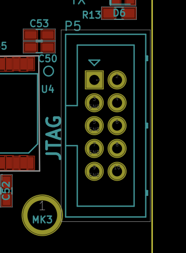
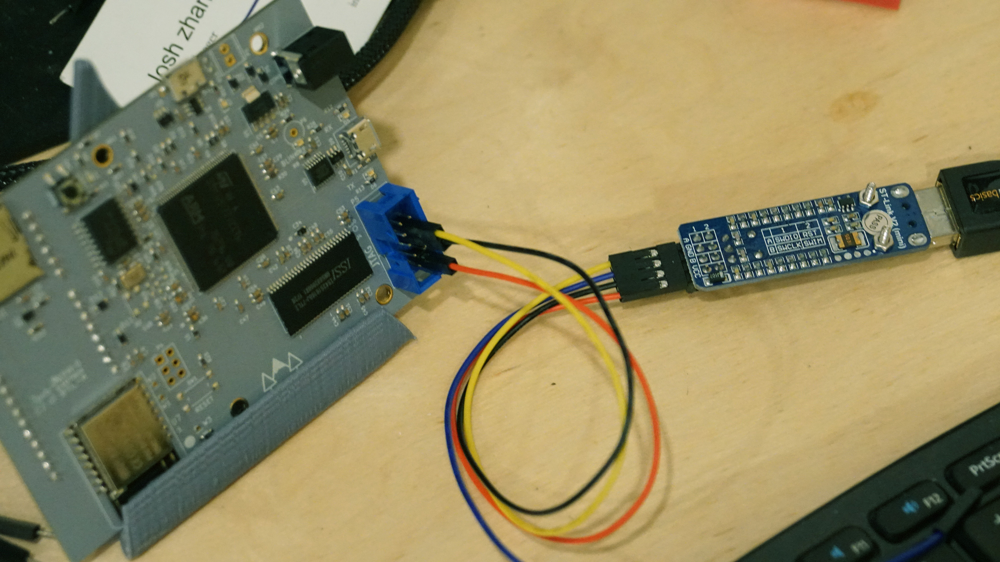

# Meadow OS

## Build Instructions

These instructions are for Mac/Linux.

### Step 1: Repo Structure

 1. Create a folder called `Meadow`. Open a terminal window, change directory to where you want the `Meadow` folder and execute:
```
mkdir Meadow
```
 2. In the `Meadow` folder, clone the _meadow_ repo into a folder called `Nuttx`. From terminal, execute:
```
git clone git@github.com:WildernessLabs/Meadow.git Nuttx
```
 4. Switch to the `wip` branch:
```
cd ./Nuttx
git checkout wip
```
 5. In the `Meadow` folder, clone the Nuttx `tools` repo:
```
git clone https://bitbucket.org/nuttx/tools.git
```
 6. In the `Meadow` folder, clone the Nuttx `apps` repo:
```
git clone https://bitbucket.org/nuttx/apps.git
```

Your Meadow folder should then look like:

```
 - Meadow
   |- apps
   |- Nuttx
   |- tools
```

### Step 2: Configure Toolchain

 1. Install ARM GCC:
```
brew install osx-cross/arm/arm-gcc-bin
```
 2. Install the STLink utilities:
```
brew install stlink
```

### Step 3: Configure the Build

 1. Configure the `tools/kconfig`:
```
cd tools/kconfig-frontends
./configure --enable-mconf --disable-nconf --disable-gconf --disable-qconf
make
make install
```
 2. Configure the `stm32f777zit6-meadow` build flavor:
```
cd ../../
./Nuttx/tools/configure.sh stm32f777zit6-meadow/nsh
```
 3. Make the Nuttx project:
```
cd ./Nuttx/
make
```

### (Optional) Step 4. Configure Serial Port for Debugging

 1. Plug a micro-USB cable into the **USB Serial Debugging** port (micro-usb plug on the right side of the Meadow board, above the JTAG plug).
 2. Request the ID of your serial port:
```
ls /dev/tty.usbserial*
```
 3. Save this ID. You'll use it later to view serial output via:
```
screen /dev/tty.usbserial-[ID] 115200
````
Where `[ID]` should be replaced with the ID of your serial port.
 
 
### Step 5: Configure JTAG

 1. Wire the following STLink V2 pins to the JTAG connector on the board:
```
VCC -> JTAG 10 (NRST)
SWCLOCK -> JTAG6 (JTCK)
SWDIO  -> JTAG4 (JTMS)
```
   The JTAG pinout is as follows, pin 1 is top left, pin 2 is top right:

   
   
   The end result should look similar to the following:

   

 2. Plug the ST-Link directly into your computer (or at least a powered USB hub). The ST-Link likely won't work in an unpowered hub. The ST-Link should blink red two or three times and then glow a steady red.

### Step 6: Test ST-Util

 1. From a terminal window, run:
```
st-util
```

The output should look something like the following:

```
bryans-MacBook-Pro:Nuttx bryancostanich$ st-util
st-util 1.4.0
2018-03-01T19:11:27 INFO src/common.c: Loading device parameters....
2018-03-01T19:11:27 INFO src/common.c: Device connected is: F76xxx device, id 0x10006451
2018-03-01T19:11:27 INFO src/common.c: SRAM size: 0x80000 bytes (512 KiB), Flash: 0x200000 bytes (2048 KiB) in pages of 2048 bytes
2018-03-01T19:11:27 INFO src/gdbserver/gdb-server.c: Chip ID is 00000451, Core ID is  5ba02477.
2018-03-01T19:11:27 INFO src/gdbserver/gdb-server.c: Chip clidr: 09000003, I-Cache: off, D-Cache: off
2018-03-01T19:11:27 INFO src/gdbserver/gdb-server.c:  cache: LoUU: 1, LoC: 1, LoUIS: 0
2018-03-01T19:11:27 INFO src/gdbserver/gdb-server.c:  cache: ctr: 8303c003, DminLine: 32 bytes, IminLine: 32 bytes
2018-03-01T19:11:27 INFO src/gdbserver/gdb-server.c: D-Cache L0: 2018-03-01T19:11:27 INFO src/gdbserver/gdb-server.c: f00fe019 LineSize: 8, ways: 4, sets: 128 (width: 12)
2018-03-01T19:11:27 INFO src/gdbserver/gdb-server.c: I-Cache L0: 2018-03-01T19:11:27 INFO src/gdbserver/gdb-server.c: f01fe009 LineSize: 8, ways: 2, sets: 256 (width: 13)
2018-03-01T19:11:27 INFO src/gdbserver/gdb-server.c: Listening at *:4242...
```

Also, the ST-Link LED should change to green. 

If all is good, close ST-Util by pressing `ctrl-c`, to release ST-Util for VS Code to use.

### Step 7: Open Meadow in VS Code

VS Code can be installed from [here](https://code.visualstudio.com/).

 1. Launch VS Code
 2. Open the `Nuttx` folder. **File > Open**, navigate to the folder and click open.
 3. If it prompts you to install the C++ extension, install it and restart VS Code.
 4. Build the project by pressing `Command + Shift + B`. This should build, and deploy over USB by writing to the flash and start the OS.


## Debugging

Set a breakpoint in the `__start` method in `stm32_start.c`.


## Manual Flashing

Meadow can be manually flashed to the device via:

```
st-flash write nuttx.bin 0x08000000
```